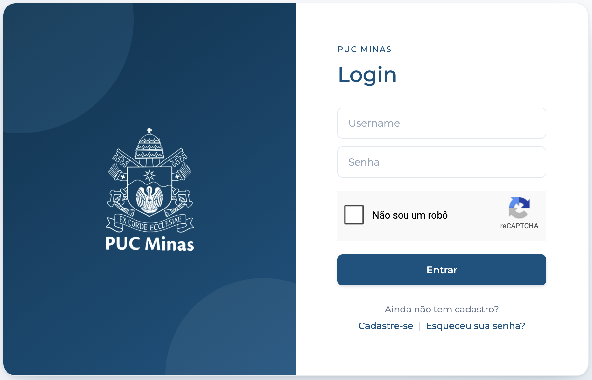
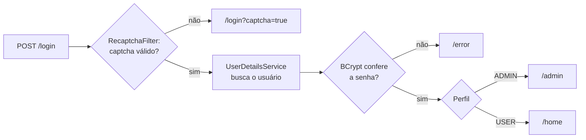
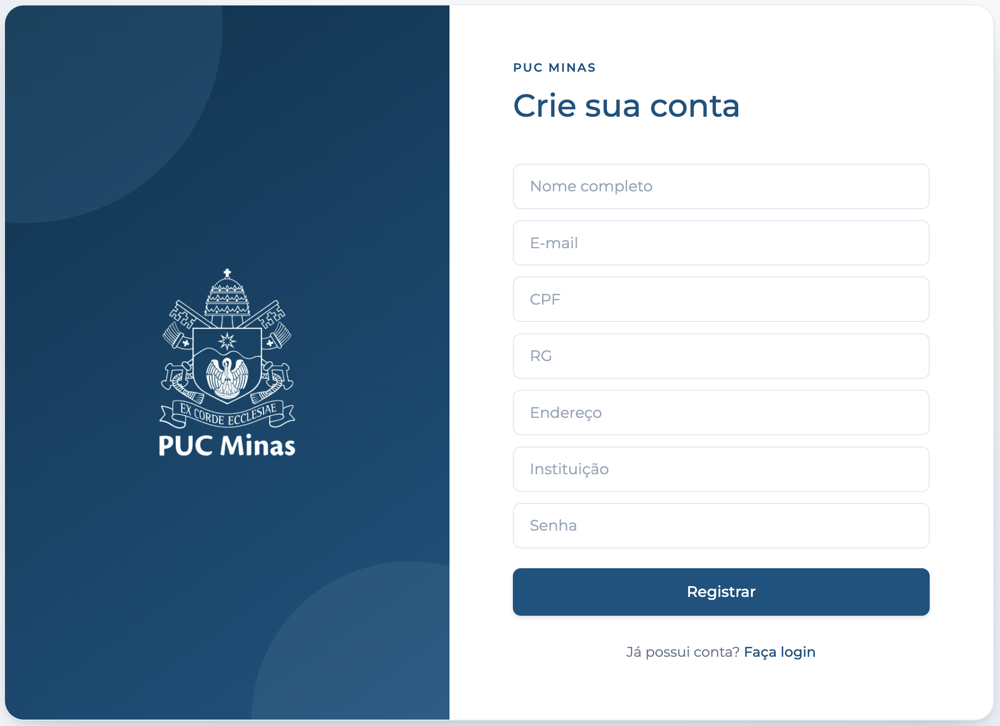
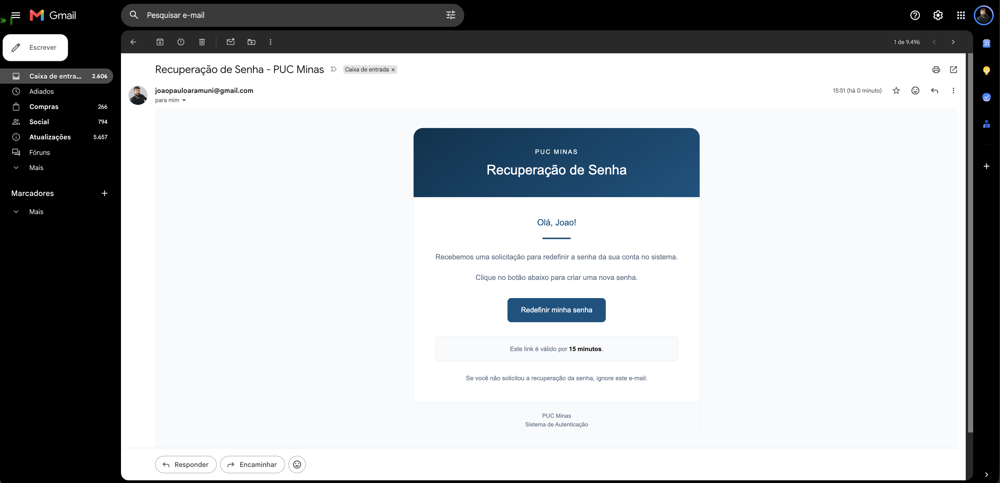

# 🔐 TelasLogin · Spring Boot


Coleção de telas de login feitas com **Spring Boot** e **Spring Security**. Todas partem da mesma base (login seguro, cadastro, recuperação de senha por e-mail e Google reCAPTCHA) e cada variante troca uma peça da arquitetura: **onde os usuários ficam salvos** e **como o front-end é feito**.

A ideia é ter um módulo de autenticação pronto para copiar para projetos novos, escolhendo a variante que faz mais sentido para cada caso.

<p align="center">
  
</p>

---

## 📦 Variantes

| Projeto | Front-end | Onde ficam os usuários | Status | Documentação |
|---------|-----------|------------------------|--------|--------------|
| [**TelaLogin (Thymeleaf)**](TelaLogin%28Thymeleaf%29/TelaLogin) | Thymeleaf | Em memória | ✅ Pronto | [README](TelaLogin%28Thymeleaf%29/TelaLogin/README.md) |
| [**TelaLogin + Supabase**](TelaLogin+Supabase) | Thymeleaf | PostgreSQL no Supabase | ✅ Pronto | [README](TelaLogin+Supabase/README.md) |
| **TelaLogin + React + MongoDB** | React | MongoDB | 🚧 Planejado | — |

> Cada variante é um projeto Maven independente, com o seu próprio `pom.xml`, `application.properties` e README detalhado. Este arquivo é só o mapa geral.

---

## ✨ O que todas têm em comum

- **Login com e-mail e senha**, com as senhas guardadas em hash **BCrypt** (`PasswordEncoder`)
- **Google reCAPTCHA v2** no login, validado no servidor por um filtro próprio (`RecaptchaFilter`) antes do Spring Security autenticar
- **Cadastro** de novos usuários em `/register`
- **Recuperação de senha por e-mail** (Gmail via Spring Mail), com link válido por **15 minutos**
- **Dois perfis de acesso**: `USER` vai para `/home` e `ADMIN` vai para `/admin` (só o admin acessa `/admin/**`)
- **Proteção CSRF** ativa nos formulários (`th:action`)
- **Credenciais fora do código**: Gmail, reCAPTCHA e banco são lidos de um arquivo `.env` com o [`spring-dotenv`](https://github.com/paulschwarz/spring-dotenv)
- **Tratamento global de exceções** (`GlobalExceptionHandler`)

---

## 🤔 Qual variante usar?

|                                | TelaLogin (Thymeleaf)                                           | TelaLogin + Supabase                                            |
|--------------------------------|-----------------------------------------------------------------|-----------------------------------------------------------------|
| **Onde ficam os usuários**     | `InMemoryUserDetailsManager`                                    | Tabela `users` no PostgreSQL do Supabase (Spring Data JPA)      |
| **Depois de reiniciar**        | Os cadastros somem                                              | Os cadastros continuam salvos                                   |
| **Usuários iniciais**          | Um usuário comum e um admin definidos no `application.properties` (`app.user.*` e `app.admin.*`) | Admin criado no banco pelo `AdminSeeder` na primeira subida |
| **Dados do cadastro salvos**   | E-mail, senha e nome                                            | E-mail, senha, nome, CPF, RG, endereço e instituição            |
| **Precisa de banco?**          | Não                                                             | Sim (projeto no Supabase + `supabase/schema.sql`)               |
| **Indicado para**              | Estudar Spring Security, protótipos e testes rápidos            | Reaproveitar como módulo de login em projetos reais             |

Nas duas variantes os tokens de recuperação de senha ficam em memória: se a aplicação reiniciar, os links já enviados deixam de valer.

---

## 🔄 Como o login funciona



O fluxo é o mesmo nas duas variantes. O que muda é quem entrega o usuário ao Spring Security: o `InMemoryUserDetailsManager` na versão em memória e o `DatabaseUserDetailsService` (que consulta o Supabase) na outra.

**Recuperação de senha:** `/recoverpassword` gera um token e envia o link por e-mail → `/resetpassword?token=...` grava a nova senha (com BCrypt) e invalida o token.

---

## 🛠️ Tecnologias

| Camada | Tecnologia |
|--------|------------|
| Linguagem | Java 17 |
| Framework | Spring Boot 3.3.5 |
| Segurança | Spring Security + BCrypt |
| Front-end | Thymeleaf, HTML e CSS |
| E-mail | Spring Mail (SMTP do Gmail) |
| Anti-bot | Google reCAPTCHA v2 |
| Configuração | spring-dotenv 4.0.0 |
| Banco (variante Supabase) | PostgreSQL no Supabase, Spring Data JPA / Hibernate |
| Build | Maven |

---

## 🗂️ Estrutura do repositório

```text
TelasLogin-SpringBoot-/
│
├── README.md                        ← você está aqui
│
├── TelaLogin(Thymeleaf)/
│   └── TelaLogin/                   ← variante com usuários em memória
│       ├── README.md
│       ├── pom.xml
│       ├── src/main/java/.../       application, config, controller, exception, service
│       ├── src/main/resources/      application.properties, templates e CSS
│       ├── imgs/                    prints das telas
│       └── GuiaParaUsosFuturos/     guias em HTML para consulta
│
└── TelaLogin+Supabase/              ← variante com PostgreSQL no Supabase
    ├── README.md
    ├── pom.xml
    ├── src/main/java/.../           mesma base + models, repository e AdminSeeder
    ├── src/main/resources/
    ├── supabase/schema.sql          cria a tabela "users"
    ├── imgs/
    └── GuiaParaUsosFuturos/
```

---

## 🚀 Como rodar

### Pré-requisitos

- **Java 17+** e **Maven**
- **Conta Gmail** com verificação em duas etapas e uma [senha de app](https://myaccount.google.com/apppasswords)
- **Chaves do reCAPTCHA v2** ("Não sou um robô") criadas em [google.com/recaptcha/admin](https://www.google.com/recaptcha/admin), com `localhost` nos domínios
- **Só na variante Supabase:** um projeto no [Supabase](https://supabase.com) com o `supabase/schema.sql` já executado

### Passo a passo

```bash
git clone https://github.com/leonardoMartins-Dev/TelasLogin-SpringBoot-.git

# escolha a variante
cd "TelasLogin-SpringBoot-/TelaLogin(Thymeleaf)/TelaLogin"
# ou
cd "TelasLogin-SpringBoot-/TelaLogin+Supabase"

# crie o arquivo .env na raiz do projeto escolhido (veja abaixo) e rode
mvn spring-boot:run
```

Depois é só abrir **http://localhost:8080/login**.

> Use `mvn` em vez de `./mvnw`: a pasta `.mvn/` não está no repositório, então o wrapper não funciona. Também dá para rodar pelo *Spring Boot Dashboard* do VS Code.

### Variáveis do `.env`

| Variável | Thymeleaf | Supabase | Onde conseguir |
|----------|:---------:|:--------:|----------------|
| `MAIL_USERNAME` | ✔ | ✔ | Seu e-mail do Gmail |
| `MAIL_PASSWORD` | ✔ | ✔ | Senha de app do Google |
| `RECAPTCHA_SITE_KEY` | ✔ | ✔ | Painel do reCAPTCHA |
| `RECAPTCHA_SECRET_KEY` | ✔ | ✔ | Painel do reCAPTCHA |
| `SUPABASE_DB_URL` | | ✔ | Supabase → *Connect* → *Session pooler* |
| `SUPABASE_DB_USER` | | ✔ | Supabase → *Connect* → *Session pooler* |
| `SUPABASE_DB_PASSWORD` | | ✔ | Senha definida ao criar o projeto no Supabase |

O `.env` contém credenciais reais e **não deve ser versionado**. O passo a passo completo de cada variante (incluindo como montar a URL do Supabase) está no README dela.

---

## 🧭 Rotas

| Rota | Acesso | O que faz |
|------|--------|-----------|
| `/login` | Público | Login com e-mail, senha e reCAPTCHA |
| `/login?logout=true` | Público | Tela de login após sair |
| `/register` | Público | Cadastro de novo usuário |
| `/recoverpassword` | Público | Pede o link de recuperação por e-mail |
| `/resetpassword?token=...` | Público | Define a nova senha (link do e-mail) |
| `/home` | Usuário autenticado | Página inicial do usuário |
| `/admin` | Somente `ADMIN` | Área administrativa |
| `/error` | Público | Página de erro de login |

---

## 🖼️ Telas

|  |  |
|:---:|:---:|
| Cadastro | E-mail de recuperação de senha |

---

## 🗺️ Roadmap

- [x] **TelaLogin (Thymeleaf)**: usuários em memória
- [x] **TelaLogin + Supabase**: usuários persistidos no PostgreSQL
- [ ] **TelaLogin + React + MongoDB**: front-end em React consumindo uma API Spring, com usuários no MongoDB

---

## 👤 Autor

**Leonardo Martins**: [@leonardoMartins-Dev](https://github.com/leonardoMartins-Dev)

## 📄 Licença

Este projeto está licenciado sob a MIT License.
